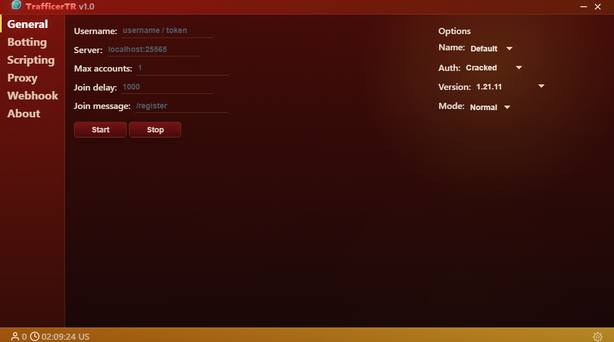
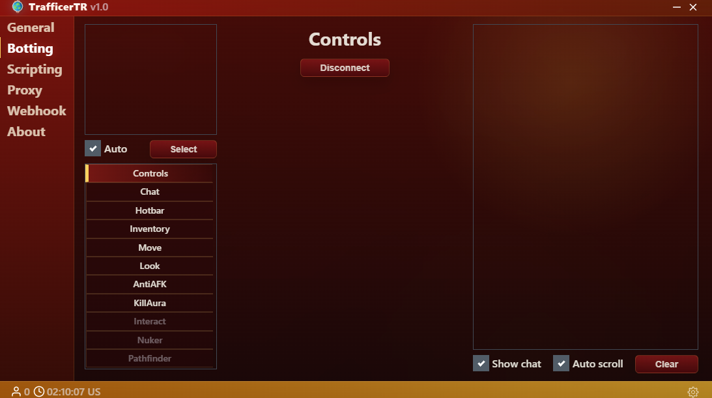
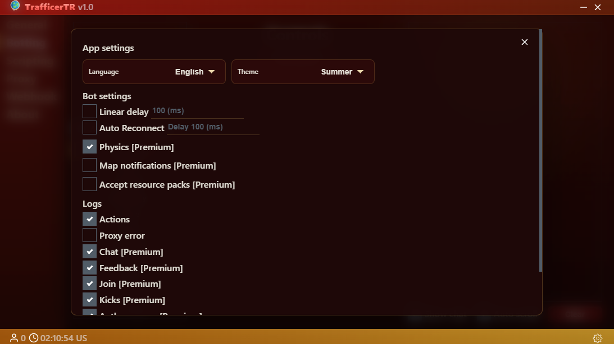

# TrafficerTR

TrafficerTR, Minecraft botlarini tek bir masaustu arayuzunden yonetmek icin gelistirilen Electron tabanli bir istemcidir. Proje, TrafficerTR v1.0 ile yeni arayuz, coklu dil destegi, tema secimi, script calistirma, proxy testleri ve Discord webhook loglari uzerine odaklanir.

> Not: Bu araci yalnizca kendi sunucularinda, izinli test ortamlarinda veya gelistirme amacli kullan. Baska sunuculara zarar vermek, spam yapmak veya izinsiz trafik olusturmak icin kullanilmasi uygun degildir.

## Ozellikler

- Minecraft bot baglantilarini baslatma, durdurma ve izleme
- Botlar icin chat, hareket, envanter, hotbar, Anti AFK ve KillAura kontrolleri
- Botlar uzerinde basit script calistirma
- Proxy listesi ekleme, proxy test etme ve proxy loglarini takip etme
- Discord webhook ile bot olaylarini, sunucu sohbetini ve proxy loglarini gonderme
- Turkce ve English dil secimi
- Summer ve Winter tema secimi
- Gercek zamanli bolgesel saat ve gece/gunduz atmosferi
- TrafficerTR icin yeni animasyonlu acilis ekrani ve yeni marka gorselleri
- GitHub uzerinden ileride kullanilacak yeni surum kontrol altyapisi

## Durum

- Uygulama adi: TrafficerTR
- Surum: v1.0.0
- 26.1.x Minecraft protokol destegi native destek gelene kadar gecici olarak askida
- Interact, Nuker ve Pathfinder kontrolleri gecici olarak bakim modunda

## Kurulum

Gerekenler:

- Node.js
- npm

Bagimliliklari kur:

```bash
npm install
```

Gelistirme modunda calistir:

```bash
npm run dev
```

Production build al:

```bash
npm run build
```

Windows icin paketle:

```bash
npm run build:win
```

## Ekran Goruntusu Ekleme

README icinde ekran goruntusu gostermek icin gorseli proje icinde tutman yeterli. Hazir klasor:

```text
docs/screenshots/
```

Ornek kullanim:

1. Uygulamayi ac.
2. Windows'ta `Win + Shift + S` ile ekran goruntusu al.
3. Gorseli `docs/screenshots/main.png` olarak kaydet.
4. README icine su satiri ekle:

```md

```

Birden fazla ekran goruntusu icin:

```md


```

Dosya adi kucuk harfli ve bosluksuz olursa GitHub'da daha sorunsuz gorunur.

## Gelistirici

My name is Glock (Cmmdx).

TrafficerTR; daha temiz bir arayuz, yeni Minecraft surumlerine daha iyi uyumluluk ve kendi derleyip kullanmak isteyenler icin daha akici bir deneyim hedefiyle gelistirilmektedir.

